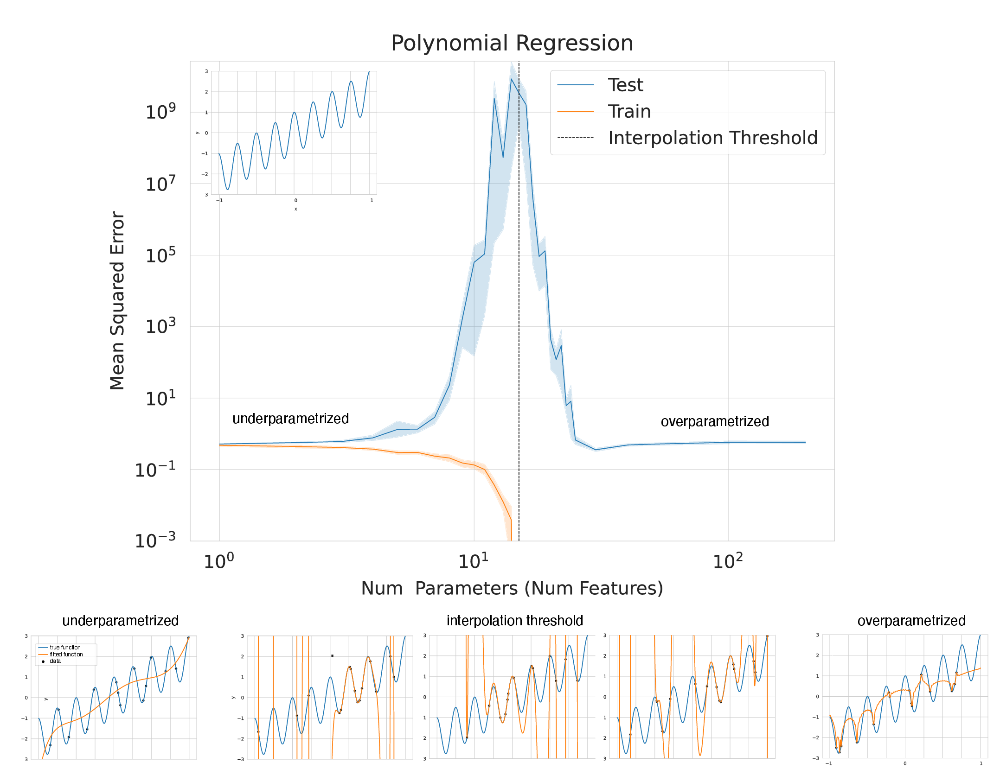

# What Double Descent Is and Why It Occurs
## An Intuitive, Interpretable Understanding with Causal Ablations

This repository contains the code and data for our preprint 
"What Double Descent Is and Why It Occurs: An Intuitive, Interpretable Understanding with Causal Ablations".
The tutorial will be available on arXiv (and SAIL Blog and LessWrong?).

[Overleaf Draft](https://www.overleaf.com/read/xscfwstjdqwy)

## Polynomial Regression on Synthetic Data

  

## Ordinary Linear Regression on Real Data

  
  

## Mathematical Explanation in Ordinary Linear Regression

Let $X \in \mathbb{R}^{N \times D}, Y \in \mathbb{R}^{N \times 1}$ denote our training data features and targets, respectively, and
let $\vec{x}_{test} \in \mathbb{R}^D$ be a new test datum features.
Let $X := U S V^T$ denote the singular value decomposition of $X$ with rank $R$, $E = Y - X \beta^*$ denote the
residuals of the best possible model in the model class (i.e. insurmountable "errors" from the "perspective" of the model class).
_The below equation is critical_. It reveals that our test prediction error (and thus, our test squared error!) will
depend on an interaction between 3 quantities:

$$\sum_{r=1}^R  \frac{1}{\sigma_r} (\vec{x}_{test} \cdot \vec{v}_r) (\vec{u}_r \cdot E)$$

1. How much the training features $X$ vary in each direction; more formally, the inverted (non-zero) singular values of the training features $X$:

$$\frac{1}{\sigma_r}$$
    
2. How much, and in which directions, the test features vary relative to the training features $X$; more formally: how $\vec{x}_{test}$ projects onto $X$'s right singular vectors $V$:
    
    $$\vec{x}_{test} \cdot \vec{v}_r$$
    
3. How well the best possible model in the model class can correlate the variance in the training features $X$ with the training regression targets $Y$; more formally: how the residuals $E$ of the best possible model project onto $X$'s left singular vectors $U$:
    
    $$\vec{u}_r \cdot E$$

Double descent occurs when these three quantities grow extreme: (i) the training features contain small-but-nonzero
variance in some singular direction(s), (ii) from the ``perspective" of the model class, residual errors in the training features and targets
have large projection along this singular mode, and (iii) the test features vary significantly along this singular mode.
When (i) and (ii) co-occur, this means the model's parameters along this mode are likely incorrect. Then, when
(iii) is added to the mix by a test datum $\vec{x}_{test}$ with a large projection along this mode, the model is forced
to extrapolate significantly beyond what it saw in the training data, in a direction where the training data had
an error-prone relationship between its training predictions and the training regression targets, using parameters
that are likely wrong. As a consequence, the test squared error explodes!
   
## Causal Ablations on Real Data

  
  
  

**Double descent will not occur if any of the three critical quantities are absent.** 
We demonstrate this via causal ablations. Left to Right: Double descent appears in ordinary linear regression. 
Removing small singular values in the training features $X$ prevents double descent. 
Preventing the test features $\vec{x}_{test}$ from varying in the trailing singular modes of the training features $X$
prevents double descent. Ensuring that the optimal model in the model class has zero residual
prediction errors $E$ prevents double descent.

## Attribution

Authors: Rylan Schaeffer, Mikail Khona, Zachary Robertson, Akhilan Boopathy, Kateryna Pistunova, Ila Rani Fiete, Sanmi Koyejo.