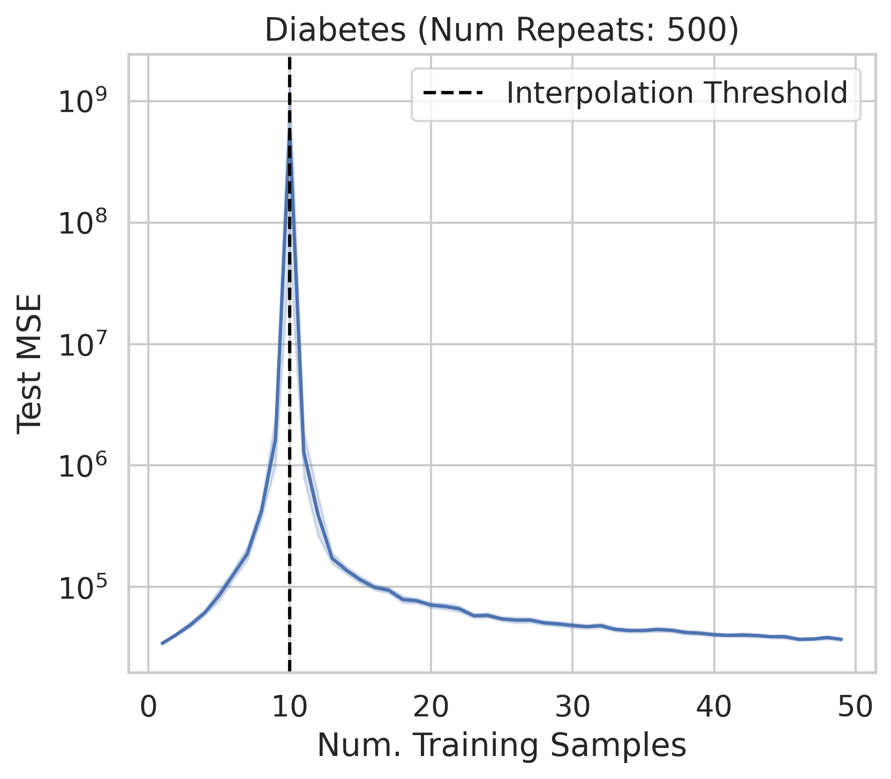

# An Introductory Tutorial on Double Descent
## What Double Descent Is and Why It Occurs

Authors: Rylan Schaeffer, etc.

This repository contains the code and data for our preprint 
"An Introductory Tutorial on Double Descent: What Double Descent Is and Why It Occurs".
The tutorial will be available on arXiv (and LessWrong?).

[Overleaf Draft](https://www.overleaf.com/read/xscfwstjdqwy)

  
  
  

