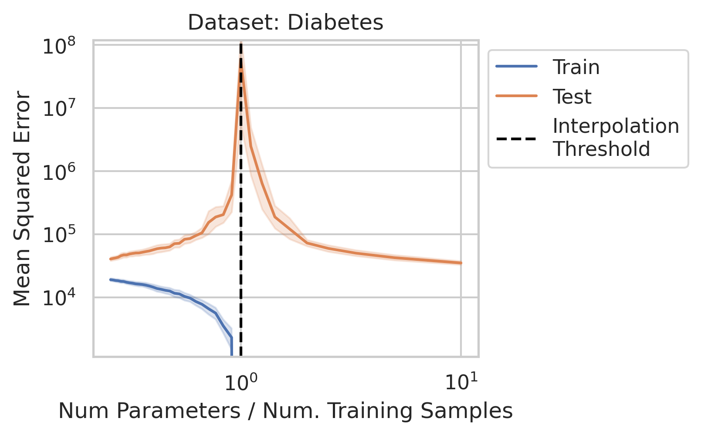
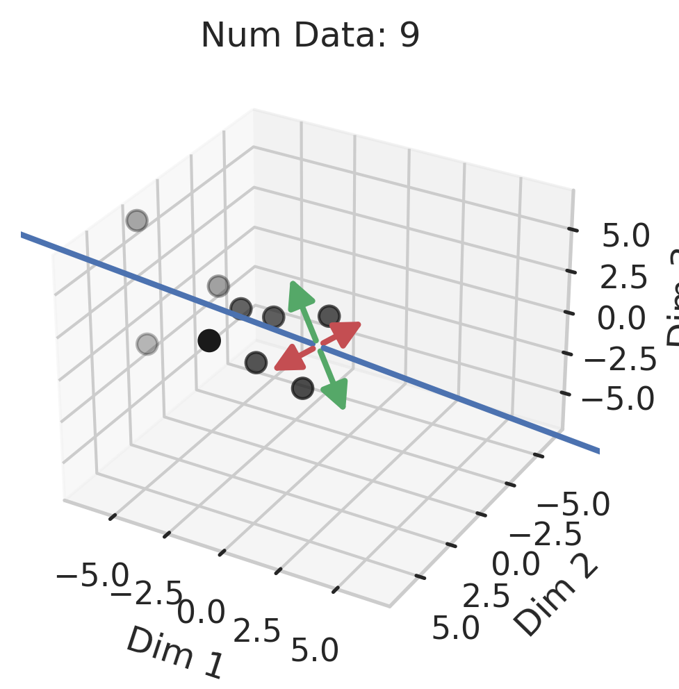
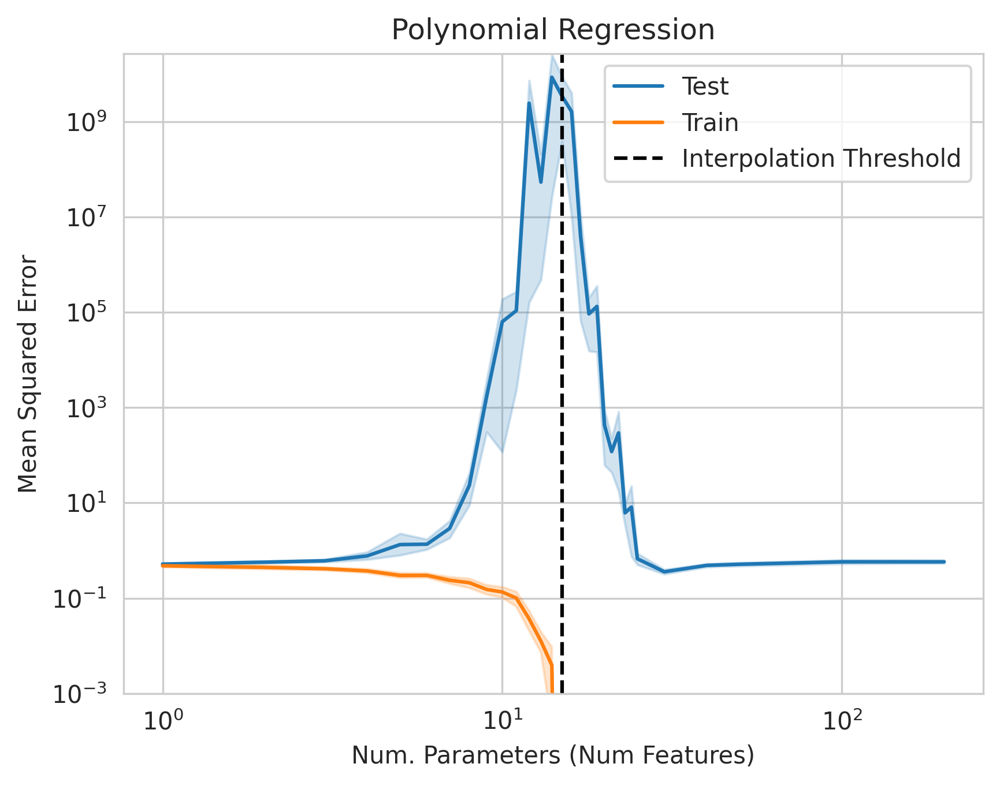

# Double Descent Demystified: Identifying, Interpreting & Ablating the Sources of a Deep Learning Puzzle

This repository contains the code and data for our preprint
["Double Descent Demystified: Identifying, Interpreting \& Ablating the Sources of a Deep Learning Puzzle"](https://arxiv.org/abs/2303.14151).

  
  
  
  

## Setup

We include a conda environment file but this is honestly overkill. You should only need `matplotlib`,
`numpy`, `pandas`, `scikit-learn` and `seaborn`. If you insist on a new conda environment, here are the steps:

(Optional) Update conda:

`conda update -n base -c defaults conda`

Create a conda environment with the required packages:

`conda env create --file environment.yml`

To activate the environment:

`conda activate double_descent`

## Running

Note: The code was written for simplicity and understandability.
Minimizing code duplication was intentionally not a priority. 

### Double Descent in Linear Regression

To reproduce the double descent and the ablations of each of the three factors,
run [linear_regression_ablations.py](linear_regression_ablations.py).
Note: if you want fast but noisy results, set `num_repeats` to a smaller number.

### Adversarial Training and Test Data in Linear Regression

To study how to create adversarial test examples or adversarial training data, 
run [linear_regression_adversarial.py](linear_regression_adversarial.py).
Note: if you want fast but noisy results, set `num_repeats` to a smaller number.

  
  

### Geometric Intuition for Smallest Non-Zero Singular Value

To understand why small non-zero singular values are likely to appear near the interpolation threshold,
run [smallest_nonzero_singular_value.py](smallest_nonzero_singular_value.py)

  

### Double Descent in Polynomial Regression

To build intuition in a setting where the number of parameters needn't equal the number of dimensions,
run [polynomial_regression.py](polynomial_regression.py).

  

## Contributing

Reach out to Rylan Schaeffer at rylanschaeffer@gmail.com. General preferences:

1. Use `black` to format your code. See here for more information. To install, `pip install black`. To format the repo, run black . from the root directory. 
2. Use type hints as much as possible. 
3. Imports should proceed in two blocks: (1) general python libraries, (2) custom python code. Both blocks should be alphabetically ordered.

## Authorship

Authors: Rylan Schaeffer, Zachary Robertson, Akhilan Boopathy, Mikail Khona, Kateryna Pistunova, Jason W. Rocks, Ila Rani Fiete, Sanmi Koyejo.