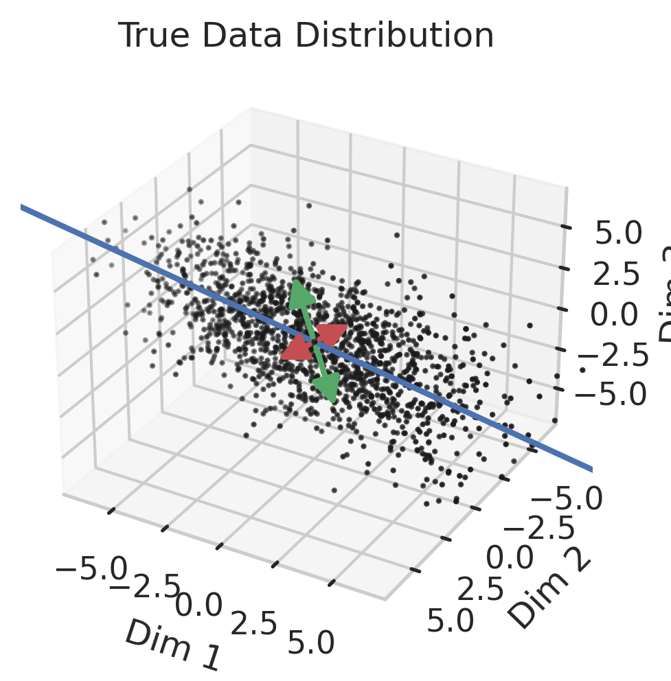
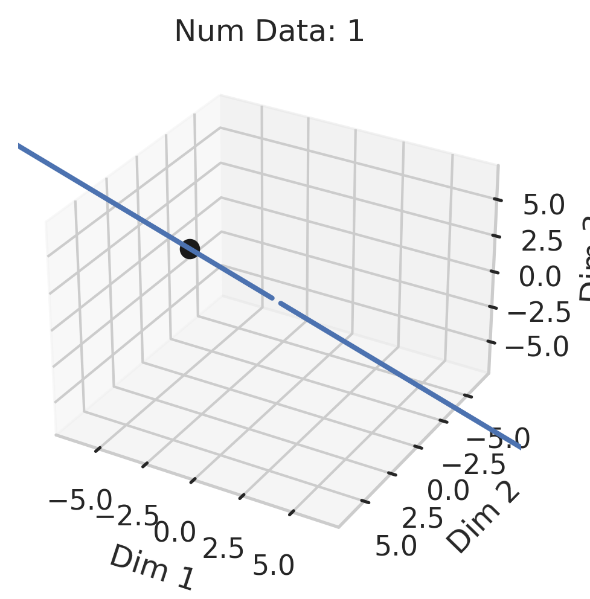
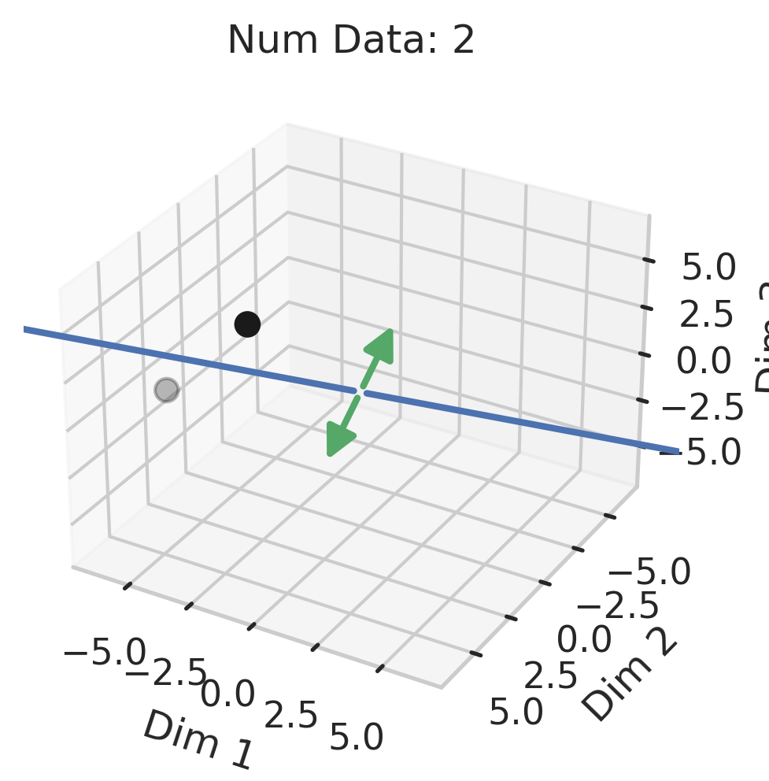
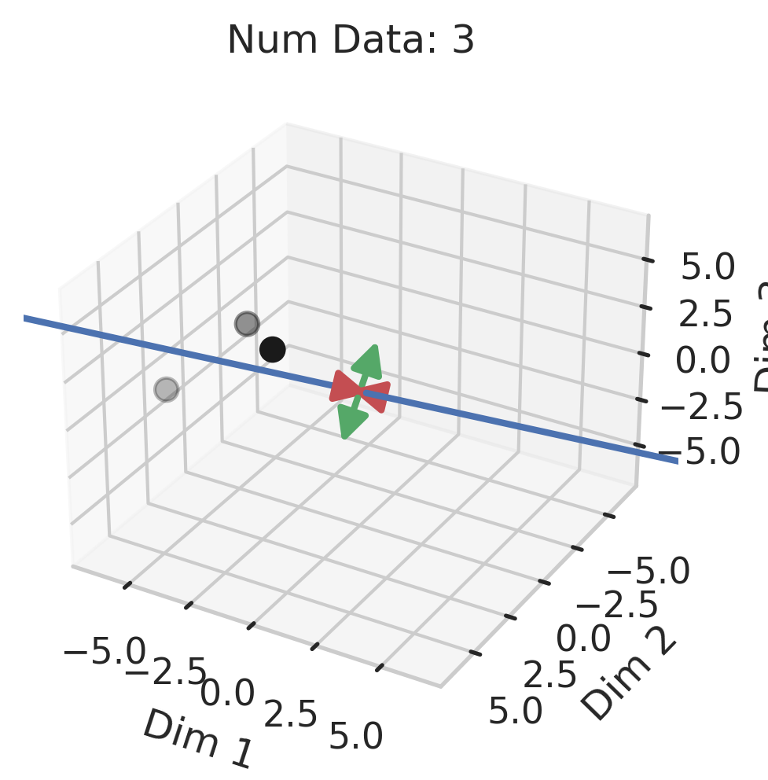
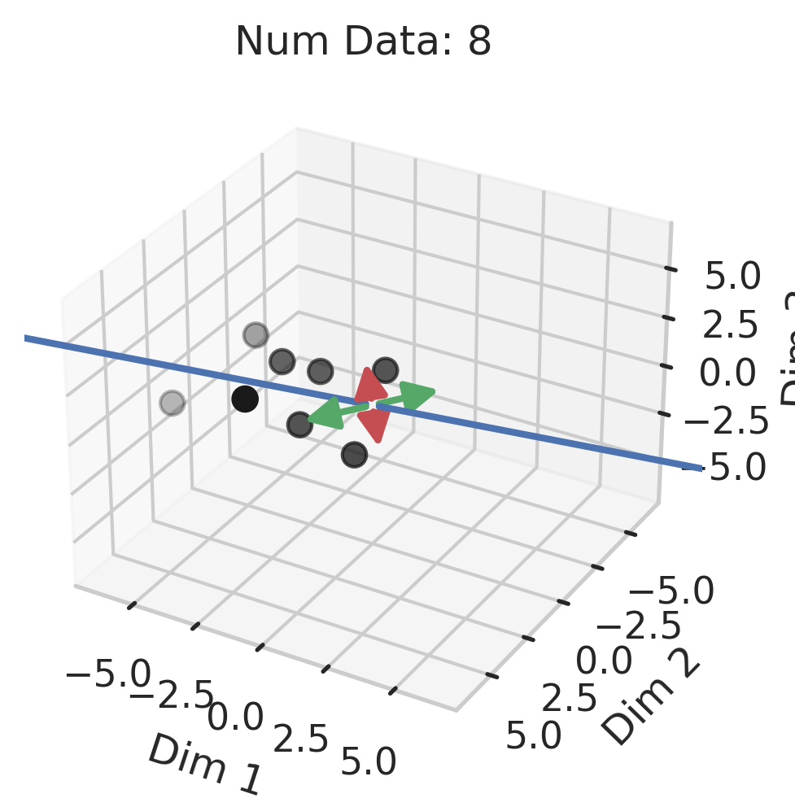
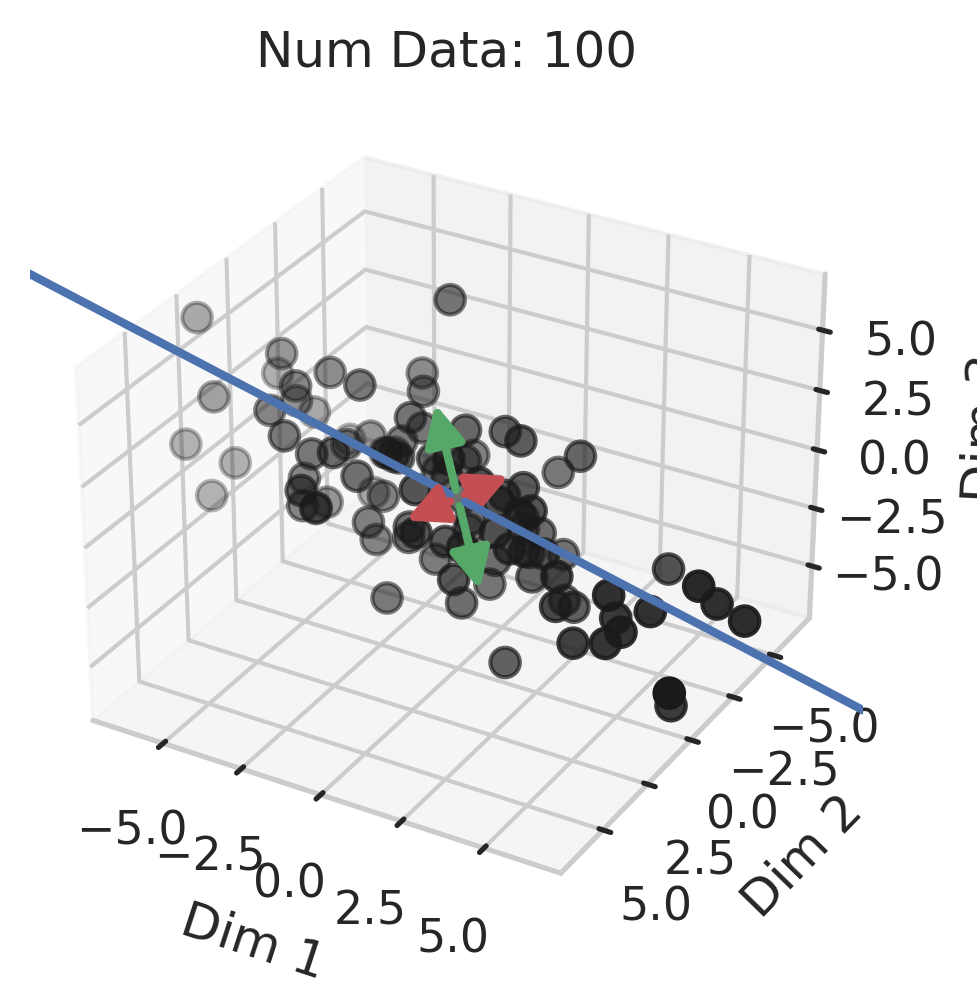

# Double Descent Demystified
## Identifying, Interpreting & Ablating the Sources of a Deep Learning Puzzle

### Table of Contents

1. [Notation & Terminology](#notation--terminology)
2. [Mathematical Intuition from Ordinary Linear Regression](#mathematical-intuition-from-ordinary-linear-regression)
3. [Geometric Intuition for Divergence at the Interpolation Threshold](#geometric-intuition-for-divergence-at-the-interpolation-threshold)
4. [Ablating the 3 Necessary Factors for Double Descent](#ablating-the-3-necessary-factors-for-double-descent)

## Notation & Terminology

Consider a supervised dataset of $N$ training data for regression:

$$ \mathcal{D} :=  \{ (\vec{x}_n, y_n) \}_{n=1}^N $$

with covariates $\vec{x}_n \in \mathbb{R}^D$ and targets $y_n \in \mathbb{R}$.
We'll sometimes use matrix-vector notation to refer to our training data, treating the
features $\vec{x}_n$ as row vectors:

$$X := \begin{bmatrix} - \vec{x}_1 - \\\\ \vdots \\\\ -\vec{x}_N - \end{bmatrix} \in \mathbb{R}^{N \times D} \quad \quad \quad \quad Y := \begin{bmatrix} y_1 \\\\ \vdots \\\\ y_N \end{bmatrix} \in \mathbb{R}^{N \times 1} $$

In general, our goal is to use our training dataset $\mathcal{D}$ find a function $f: \mathcal{X} \rightarrow \mathcal{Y}$ that makes:

$$f(x) \approx y $$

In the setting of ordinary linear regression, we assume that $f$ is a linear function
i.e. $f(\vec{x}) = \vec{x} \cdot \vec{\beta}$, meaning our goal is to find (estimate) linear
parameters $\hat{\vec{\beta}} \in \mathbb{R}^{D}$ that make: 

$$\begin{equation*} \vec{x} \cdot \vec{\beta} \approx y \end{equation*}$$

Of course, our real goal is to hopefully find a function that generalizes well to new data. 
As a matter of terminology, there are typically three key parameters:

1. The number of model parameters $P$ 
2. The number of training data $N$
3. The dimensionality of the data $D$

We say that a model is _overparameterized_ (a.k.a. underconstrained) if $N < P$ and _underparameterized_ (a.k.a. overconstrained) if $N > P$. 
The _interpolation threshold_ refers to where $N=P$, because when $P\geq N$, the model can perfectly interpolate the training points.

## Mathematical Intuition from Ordinary Linear Regression

To offer an intuitive yet quantitative understanding of double descent, we turn to ordinary linear regression.
Recall that in linear regression, the number of fit parameters $P$ must equal the dimension $D$ of the covariates; 
consequently, rather than thinking about changing the number of parameters $P$, we'll instead think about changing 
the number of data $N$. Because double descent is fundamentally about the ratio of number of parameters $P$ 
to number of data $N$, varying the number of data is as valid an approach as varying the number of parameters is. 
To understand where and why double descent occurs in linear regression, we'll study how linear regression behaves in 
the two parameterization regimes. 

**Underparameterized**: we estimate the linear relationship between the covariates $\vec{x}_n$
and the target $y_n$ by solving the classical least-squares minimization problem:

$$\hat{\vec{\beta}}_{under} := \arg \min_{\vec{\beta}} \frac{1}{N} \sum_n ||\vec{x}_n \cdot \vec{\beta} - y_n||_2^2  =  \arg \min_{\vec{\beta}} ||X \vec{\beta} - Y ||_F^2$$

The solution to this underparameterized optimization problem is the well-known ordinary least squares estimator that uses the second moment matrix $X^T X$:

$$\hat{\vec{\beta}}_{under} = (X^T X)^{-1} X^T Y$$

**Overparameterized**: the above optimization problem is ill-posed since there are infinitely many solutions;
this is because we have fewer constraints than parameters. Consequently, we need to choose a different (constrained) optimization problem:

$$\hat{\vec{\beta}}_{over}  :=  \arg \min_{\vec{\beta}} ||\vec{\beta}||_2^2 \quad \quad \text{s.t.} \quad \quad \forall  n \in \{1, ..., N\} \quad \vec{x}_n \cdot \vec{\beta} = y_n$$

One way to see why the Gram matrix appears is via constrained optimization. Define the Lagrangian with Lagrange multipliers $\vec{\lambda} \in \mathbb{R}^N$:

$$\mathcal{L}(\vec{\beta}, \vec{\lambda}) := ||\vec{\beta}||_2^2 + \vec{\lambda}^T (Y - X \vec{\beta})$$

Differentiating with respect to both the parameters and the Lagrange multipliers yields:

$$\begin{align*}
    \nabla_{\vec{\beta}}  \mathcal{L}(\vec{\beta}, \vec{\lambda}) = \vec{0} = 2\hat{\vec{\beta}} - X^T \vec{\lambda} &\Rightarrow \hat{\vec{\beta}}_{over} = \frac{1}{2} X^T \vec{\lambda}\\
    \nabla_{\vec{\lambda}} \mathcal{L}(\beta, \lambda) = \vec{0} = Y - X \hat{\vec{\beta}}_{over} &\Rightarrow Y = \frac{1}{2} X X^T \vec{\lambda}\\
    &\Rightarrow \vec{\lambda} = 2 (X X^T)^{-1} Y\\
    &\Rightarrow \hat{\vec{\beta}}_{over} = X^T (X X^T)^{-1} Y
\end{align*}$$

Here, we are able to invert the Gram matrix because it is full rank in the overparametrized regime.
After fitting its parameters, the model will make the following predictions for a given test point $\vec{x}_{test}$:

$$\begin{align*}
    \hat{y}_{test, under} &= \vec{x}_{test} \cdot \hat{\vec{\beta}}_{under} = \vec{x}_{test} \cdot (X^T X)^{-1} X^T Y\\
    \hat{y}_{test, over} &= \vec{x}_{test} \cdot \hat{\vec{\beta}}_{over} 
    = \vec{x}_{test} \cdot X^T (X X^T)^{-1} Y
\end{align*}$$

**Hidden in the above equations is an interaction between three quantities that can, when all grow extreme, create double descent.** 
To reveal the three quantities, we'll rewrite the regression targets by introducing a slightly more detailed notation.
Unknown to us, there are some ideal linear parameters $\vec{\beta}^* \in \mathbb{R}^P = \mathbb{R}^D$ that truly
minimize the test mean squared error. We can write any regression target as the inner product of the data $\vec{x}_n$ 
and the ideal parameters $\beta^*$, plus an additional error term $e_n$ that is an "uncapturable" residual from the "perspective" of the model class:

$$y_n = \vec{x}_n \cdot \vec{\beta}^* + e_n$$

In matrix-vector form, we will equivalently write:
$$Y = X \vec{\beta}^* + E$$

with $E \in \mathbb{R}^{N \times 1}$. To be clear, we are _not_ imposing assumptions on the model or data.
Rather, we are introducing notation to express that there are (unknown) ideal linear parameters, 
and possibly residuals that even the ideal model might be unable to capture; these residuals could be random
noise or could be fully deterministic patterns that this particular model class cannot capture. Using this
new notation, we rewrite the model's predictions to show how the test datum's features $\vec{x}_{test}$,
training data's features $X$ and training data's regression targets $Y$ interact. In the underparameterized regime:

$$\begin{align*}
    \hat{y}_{test,under} &= \vec{x}_{test} \cdot (X^T X)^{-1} X^T Y\\
    &= \vec{x}_{test} \cdot (X^T X)^{-1} X^T (X \beta^* + E)\\
    &= \vec{x}_{test} \cdot (X^T X)^{-1} X^T X \beta^* + \vec{x}_{test} \cdot (X^T X)^{-1} X^T E\\
    &= \vec{x}_{test} \cdot \beta^* +  \vec{x}_{test} \cdot (X^T X)^{-1} X^T E\\
    \hat{y}_{test,under} - y_{test}^* &= \vec{x}_{test} \cdot (X^T X)^{-1} X^T E
    % \hat{y}_{test,over} &= \vec{x}_{test} \cdot \vec{\beta}^* \quad + \quad \vec{x}_{test} \cdot X^T (X X^T)^{-1} E
\end{align*}$$

This equation is important, but opaque. To extract the intuition, we will replace $X$ with its [Singular Value Decomposition](https://en.wikipedia.org/wiki/Singular_value_decomposition)
$X = U \Sigma V^T$ to reveal how different quantities interact. 
Let $R := rank(X)$ and let $\sigma_1 > \sigma_2 > ... > \sigma_R > 0$ be $X$'s (non-zero) singular values.
Recalling $E \in \mathbb{R}^{N \times 1}$, we can decompose the (underparameterized) prediction error along the orthogonal singular modes:

$$\hat{y}_{test, under} - y_{test}^* = \vec{x}_{test} \cdot V \Sigma^{+} U^T E = \sum_{r=1}^R  \frac{1}{\sigma_r} (\vec{x}_{test} \cdot \vec{v}_r) (\vec{u}_r \cdot E)$$

In the overparameterized regime, our calculations change slightly:

$$\begin{align*}
    \hat{y}_{test,over} &= \vec{x}_{test} \cdot X^T (X X^T)^{-1}  Y\\
    &= \vec{x}_{test} \cdot X^T (X X^T)^{-1} (X \beta^* + E)\\
    &= \vec{x}_{test} \cdot X^T (X X^T)^{-1} X \beta^* + \vec{x}_{test} \cdot X^T (X X^T)^{-1} E\\
    \hat{y}_{test,over} - \vec{x}_{test} \cdot \beta^* &= \vec{x}_{test} \cdot X^T (X X^T)^{-1} X \beta^*  - \vec{x}_{test} \cdot I_{D} \beta^* + \vec{x}_{test} \cdot (X^T X)^{-1} X^T E\\
    \hat{y}_{test,over} - y_{test}^* &= \vec{x}_{test} \cdot (X^T (X X^T)^{-1} X - I_D) \beta^*  + \vec{x}_{test} \cdot (X^T X)^{-1} X^T E
\end{align*}$$

If we again replace $X$ with its SVD $U S V^T$, we can again simplify $\vec{x}_{test} \cdot (X^T X)^{-1} X^T E$. 
This yields our final equations for the prediction errors.

$$\begin{align*}
\hat{y}_{test,over} - y_{test}^* &= \vec{x}_{test} \cdot (X^T (X X^T)^{-1} X - I_D) \beta^* \quad \quad \quad \quad + && \sum_{r=1}^R  \frac{1}{\sigma_r} (\vec{x}_{test} \cdot \vec{v}_r) (\vec{u}_r \cdot E)\\
    \hat{y}_{test,under} - y_{test}^* &= &&\sum_{r=1}^R  \frac{1}{\sigma_r} (\vec{x}_{test} \cdot \vec{v}_r) (\vec{u}_r \cdot E)
\end{align*}$$

What is the discrepancy between the underparameterized prediction error and the overparameterized prediction error, 
and from where does the discrepancy originate? The overparameterized prediction error has the extra term $\vec{x}_{test} \cdot (X^T (X X^T)^{-1} X - I_D) \beta^*$.

To understand where this term originates, recall that our goal is to understand how fluctuations in the features $\vec{x}$
correlate with fluctuations in the targets $y$. In the overparameterized regime, there are more parameters than there
are data. Consequently, for $N$ data points in $D=P$ dimensions, the model can "see" fluctuations in at most $N$ dimensions,
but cannot "see" fluctuations in the remaining $P-N$ dimensions. This causes information about the optimal linear relationship
$\vec{\beta}^*$ to be lost, which in turn increases the overparameterized prediction error $\hat{y}_{test, over} - y_{test}^*$.
Statisticians call this term $\vec{x}\_{test} \cdot (X^T (X X^T)^{-1} X - I_D) \beta^*$ the "bias". 
The other term (the "variance") is what causes double descent:

$$\sum_{r=1}^R  \frac{1}{\sigma_r} (\vec{x}_{test} \cdot \vec{v}_r) (\vec{u}_r \cdot E)$$

**This equation is critical.** It reveals that our test prediction error (and thus, our test squared error!)
will depend on an interaction between 3 quantities:

1. How much the training features $X$ vary in each direction; more formally, the inverse (non-zero) singular values of the training features $X$:

$$\frac{1}{\sigma_r}$$

2. How much, and in which directions, the test features $\vec{x}_{test}$ vary relative to the training features $X$; more formally: how $\vec{x}_{test}$ projects onto $X$'s right singular vectors $V$:

$$\vec{x}_{test} \cdot \vec{v}_r$$

3. How well the best possible model in the model class can correlate the variance in the training features $X$ with the training regression targets $Y$; more formally: how the residuals $E$ of the best possible model in the model class (i.e. insurmountable "errors" from the "perspective" of the model class) project onto $X$'s left singular vectors $U$:

$$\vec{u}_r \cdot E$$
    

## Geometric Intuition for Divergence at the Interpolation Threshold

Why does this divergence happen approaching the interpolation threshold? The answer is that the first factor becomes
more likely to occur when approaching from either parameterization regime. The reason why the smallest non-zero singular
value is likely to reach its lowest value at the interpolation threshold is a probabilistic one, based on the 
[Marchenko–Pastur distribution](https://en.wikipedia.org/wiki/Marchenko\%E2\%80\%93Pastur\_distribution) 
from random matrix theory. Because the Marchenko–Pastur distribution is rather technical, we instead focus on
gaining intuition by thinking about how much variance we've seen along each orthogonal direction in the
data feature space.

  
  
  

  
  
  

Suppose we're given a single training datum $\vec{x}_1$. So long as this datum isn't exactly zero, that datum varies
in a single direction, meaning we gain information about the data distribution's variance in that direction. Of 
course, the variance in all orthogonal directions is exactly 0, which the linear regression fit will ignore. Now, 
suppose we're given a second training datum $\vec{x}_2$. Again, so long as this datum isn't exactly zero, that datum
varies, but now, some fraction of $\vec{x}_2$ might have a positive projection along $\vec{x}_1$; if this happens 
(and it likely will, since the two vectors are unlikely to be exactly orthogonal), the shared direction of the two 
vectors gives us _more_ information about the variance in this shared direction, but gives us _less_ information
about the second orthogonal direction of variation. This means that the training data's smallest non-zero singular
value after 2 samples is probabilistically smaller than after 1 sample. As we gain more training data, thereby
approaching the interpolation threshold, the probability that each additional datum has large variance in a new direction
orthogonal to all previously seen directions grows increasingly unlikely. At the interpolation threshold,
where $N = P = D$, in order for the $N$-th datum to avoid adding a small-but-nonzero singular value to the training data,
two properties must hold: (1) there must be one dimension that none of the preceding $N-1$ training data varied in,
and (2) the $N$-th datum needs to vary significantly in this single dimension. That's pretty unlikely!
As we move beyond the interpolation threshold, the variance in each covariate dimension becomes increasingly clear,
and the smallest non-zero singular values moves away from 0.

## Ablating the 3 Necessary Factors for Double Descent

Double descent will not occur if any of the three factors are absent. What could cause that?

1. *Small-but-nonzero singular values do not appear in the training data features*. One way to accomplish this is by switching from ordinary linear regression to ridge regression, which effectively adds a gap separating the smallest non-zero singular value from $0$. 
2. *The test features does not vary in different directions than the training features*. If the test datum lies entirely in the subspace of just a few of the leading singular directions, then double descent is unlikely to occur. 
3. *The best possible model in the model class makes no errors on the training data*. For instance, suppose we use a linear model class on data where the true relationship is a noiseless linear one. Then, at the interpolation threshold, we will have $D=P$ data, $P=D$ parameters, our line of best fit will exactly match the true relationship, and no double descent will occur.

To confirm our understanding, we causally test the predictions of when double descent will not occur by ablating each
of the three factors individually. Specifically, we do the following:

1. No Small Singular Values in Training Features: As we run the ordinary linear regression fitting process, as we sweep the number of training data, we also sweep different singular value cutoffs and remove all singular values of the training features $X$ below the cutoff.
2. Test Features Lie in the Training Features Subspace: As we run the ordinary linear regression fitting process, as we sweep the number of training data, we project the test features $\vec{x}_{test}$ onto the subspace spanned by the training features $X$ singular modes.
3. No Residual Errors in the Optimal Model: We first use the entire dataset to fit a linear model $\vec{\beta}^*$, then replace $Y$ with $X \vec{\beta}^*$ and $y_{test}^*$ 
with $\vec{x}_{test} \cdot \vec{\beta}^*$ to ensure the true relationship is linear. We then rerun our typical fitting process, sweeping the number of training data.

We first conduct experiments on a synthetic dataset in a student-teacher setup, and find that causally ablating each
of the three factors prevents double descent from occurring.

  

Next, we apply the same ablations to real world datasets (California Housing, Diabetes, WHO Life Expectancy) and find
in all three that removing any of the three factors prevents double descent.

  
  
  

